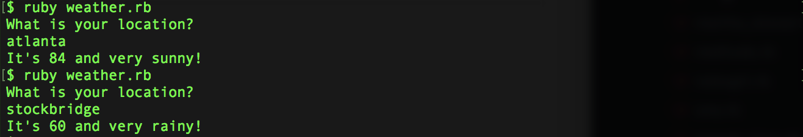
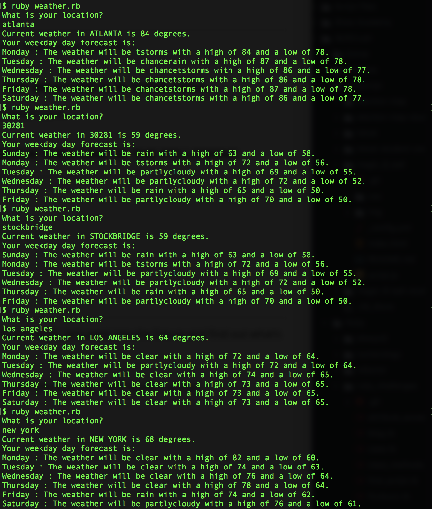

# Weather App

Weather app that allows a user to input their location (zip code, city, state, etc.), hit submit, and then, depending on real-time data that you will source from a public API, see a message customized to what the weather is like where they live.
(Ruby/Barometer gem)

* STEP 1: USER INPUTS THEIR LOCATION

* STEP 2: YOU USE A PUBLIC API TO FIND OUT WHAT THE WEATHER IS IN THEIR AREA

* STEP 3: DEPENDING ON THE WEATHER, YOU WILL SERVE THEM ONE OF THE FOLLOWING SCREENS:
  * If it’s sunny: it’s 85 degrees and sunny!
  * If it’s cloudy: 55 degrees and crazy cloudy!
  * If it’s rainy: 60 degrees and crazy rainy!
  * If it’s snowy: 32 degrees and super snowy!

* STEP 4: THEN TURN IT INTO A FORECASTING APP

### Install Ruby Gem Barometer
gem install barometer

### Weather App Screenshot

